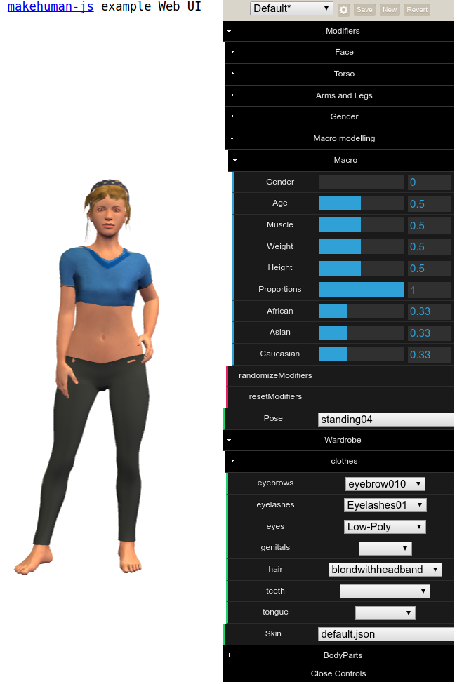

# t3aws example ui

Example web app using [t3aws](https://github.com/manofseven/t3aws)

## Install and run

- clone the repository
- run `npm install`
- run `npm start`
- open http://localhost:8080 in the browser

## Development environment

If you want to edit t3aws and t3aws-data as well you will want to set up a development environment with "npm link" and `webpack --watch`:

- clone this repo, t3aws, and t3aws-data into three seperate folders: "t3aws-demo", "t3aws" and "t3aws-data"
- in the t3aws-data folder:
  - register t3aws-data using the command [`npm link`](https://medium.com/@alexishevia/the-magic-behind-npm-link-d94dcb3a81af).  This way imports will use your local code (read more [here](http://justjs.com/posts/npm-link-developing-your-own-npm-modules-without-tears)).
- in the t3aws folder:
  - run `npm link`
  - install dev dependancies with `npm install --dev`
  - open a seperate terminal, go to this folder, and run `npm run watch`. This will have [webpack watch](https://webpack.js.org/configuration/watch/) for changes to the source code (such as human.js) and if it sees any it will regerate makehuman.js. Leave this running while you develop.
  - If you get "webpack not found" or similar, while running the previous step you may also need to install webpack globally to make the command available in the terminal: `npm install -g webpack@2.1.0`.
- in the t3aws-demo folder 
  - install dependencies with `npm install`
  - run `npm link t3aws` and `npm link t3aws-data`
  - run `npm start`
- open http://localhost:8080 in the browser

Now if you change a source file in t3aws you will see the change reflected in the web app, that means it's working.

Why do it this way? You could also refactor t3aws-demo to be a webpack app which would simplify the development process but would complicate the example. I chose a simpler example.
